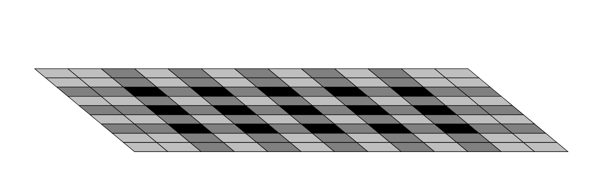
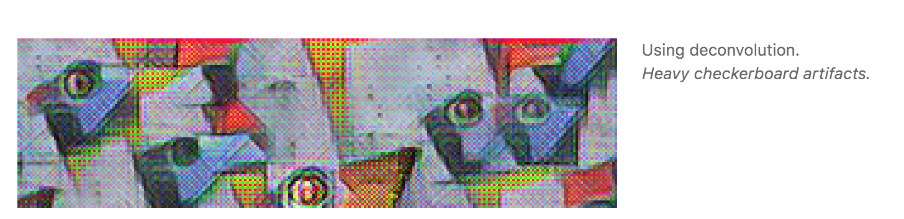

# Adversarial-ideas
Adversarial attack &amp; defense

# Proposal 1

## Checkerboard attack(white-box pixel attack)

An extension of one pixel black-box attack [[4]](#references)

**Expected Contribution**

  * Raise the fundamental problem of overlapping convoluted pixels and experimentally show that this problem is more prone to adversarial attack using ***one pixel white-box attack***.
  * Inspired from the ideas of checkerboard artifact in deconvolution, show that *gradient propagation is equally vulnerable to checkerboard artifact*.
  * Using ideas from current deconvolution checkerboard artifact relaxation methods, *suggest a defense method* if possible.

**Preliminary Results**

  * Visualize checkerboard patterns in the gradient of convolution.
  * Try Random one-pixel attack on the entire grid.
  * Try Random one-pixel attack on the checkerboard grid.

  > Show that checkerboard grid works with higher probability

  * Try differential evolutionary attack on entire grid.
  * Try differential evolutionary attack on checkerboard grid.

  > Show that checkerboard grid works within faster steps, or evolutionary pixels happen to be mostly located in checkerboard grid

**What is an "checkerboard grid?"**

It's an uneven overlap area in convolution. The trade-off is that if we avoid overlap, we loose model capacity and may fail to capture spatial patterns. On the other hand if we have large uneven overlap, deconvolutional operation creates artifacts which leads awkward checkerboard like points in the reconstructed image. Whenever we compute the gradients of a convolutional layer, we do deconvolution (transposed convolution[[2]](#references)) on the backward pass. This can cause ***checkerboard patterns in the gradient***, just like when we use deconvolution to generate images. So what does this imply? It implies that some neurons will get many times the gradient of their neighbors, which means the network cares more about certain pixels.

<figure align="center">
	
</figure>

> Fig 1. Artifact vulnerable grid - an uneven overlap

Here is an example of decovolution result with checkerboard artifact.
<figure align="center">
	
</figure>

> Fig 2. Checkerboard artifact generated from deconvolution.
Image from [[1]](#references)

**Current Solutions in deconvolution**

* Upsampling(Bilinear) + Conv [[1]](#references)
* Bilinear additive Upsampling method [[3]](#references)
* Pixel Deconvolution [[5]](#references)
* Checkerboard free initialization [[6]](#references)

# Proposal 2

## Spectral Normalizing defense

**Expected contribution**:

  * Through Spectral Normalization, we can control our Lipschitz constant of our network to be 1. This will smoothen our loss surface and thus ***require more gradient steps*** in order to increase the same amount of loss. But for now, this method does not ensure that image perturbation for adversarial example will cause the image perception to be different from the original one.

**Preliminary Results**:

  * Defense result on various attack methods.
  * Defense result on black-box, white-box one pixel attack.

## References

[1]: [Deconvolution and checkerboard artifacts](https://distill.pub/2016/deconv-checkerboard/) (2016)

[2]: [Up-sampling with Transposed Convolution](https://distill.pub/2016/deconv-checkerboard/) (2016)

[3]: [The Devil is in the Decoder](https://arxiv.org/abs/1707.05847)(Arxiv 2017.07, BMVC2017)

[4]: [One pixel attack for fooling deep neural networks](https://arxiv.org/abs/1710.08864) (black-box pixel attack, Arxiv 2017.10)

[5]: [Pixel Deconvolutional Networks](https://openreview.net/forum?id=B1spAqUp-) (Arxiv 2017.11, ICLR2018 Reject)

[6]: [Checkerboard artifact free sub-pixel convolution](https://arxiv.org/pdf/1707.02937.pdf) (Arxiv 2017.07)
